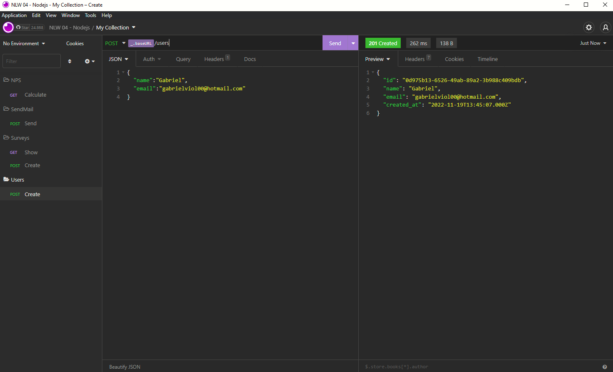
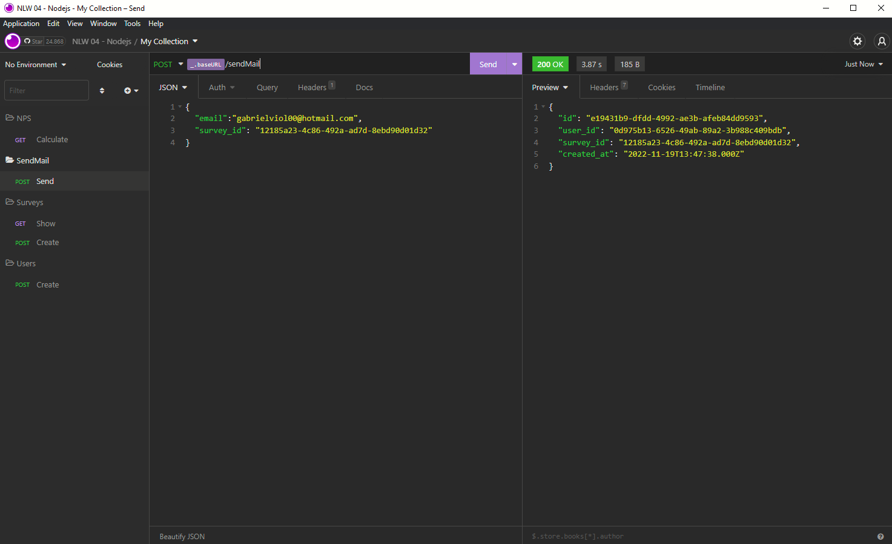
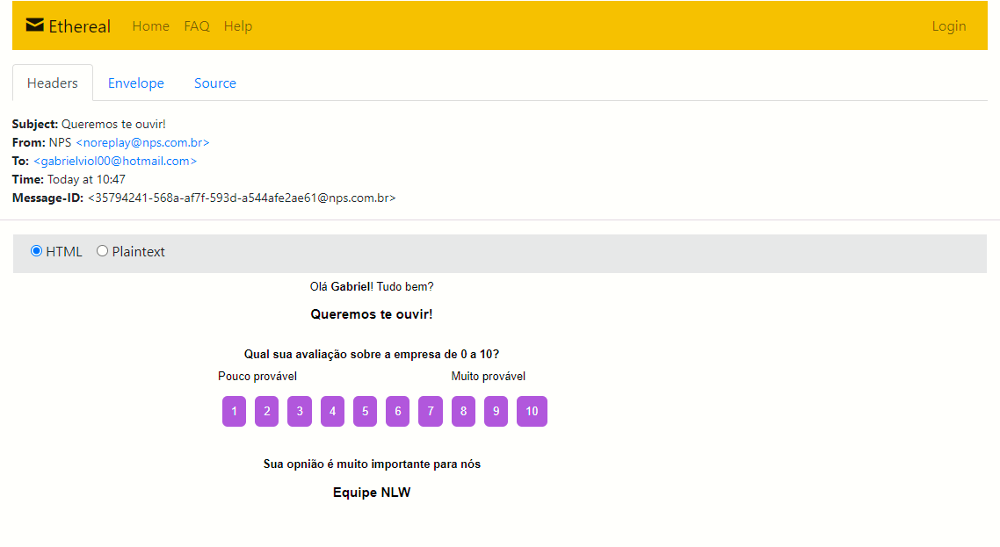
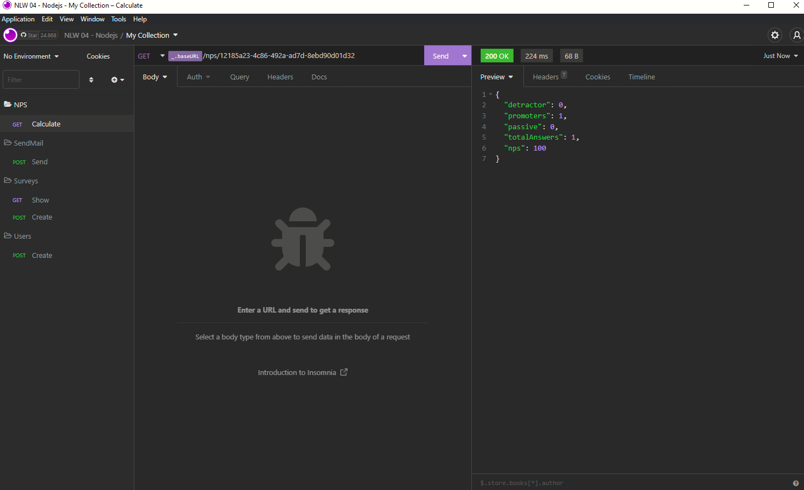

<h1 align="center">NPS-NLW</h1>

  <a href="#-tecnologias">Tecnologias</a>&nbsp;&nbsp;&nbsp;|&nbsp;&nbsp;&nbsp;
  <a href="#-projeto">Projeto</a>&nbsp;&nbsp;&nbsp;|&nbsp;&nbsp;&nbsp;
  <a href="#-como-executar">Como executar</a>&nbsp;&nbsp;&nbsp;|&nbsp;&nbsp;&nbsp;
  <a href="#-prints">Prints</a>&nbsp;&nbsp;&nbsp;

 

  

## 🚀 Tecnologias

Esse projeto foi desenvolvido com as seguintes tecnologias:

- [TypeScript](https://www.typescriptlang.org/)
- [Ethereal-Email](https://ethereal.email/)
- [TypeORM](https://typeorm.io/#/)
- [Express](https://expressjs.com/pt-br/)
- [Jest](https://jestjs.io/)
- [SQL Editor Beekeeper Studio](https://www.beekeeperstudio.io/)
- [Insomnia](https://insomnia.rest/)

## 💻 Projeto

O NPS-NLW é uma aplicação que consiste em calcular o NPS da empresa. Nele fazemos o cadastro de usuários, cadastro de pesquisas, envio de e-mail para os usuários responderem as pesquisas de satisfação e com isso podemos realizar o cálculo do NPS.

Esse projeto foi desenvolvido durante a trilha de NodeJS, na quarta edição da NLW. Aprendemos conceitos sobre o que é um API, como iniciar um projeto utilizando Typescript e Express para gerenciamento das rotas, TypeORM para manipulação dos dados, testes automatizados e envio de e-mail.

## 🏃 Como executar

- Clone o repositório
- Instale as dependências com `yarn`
- Inicie o servidor com `yarn dev`
- Para rodar testes de requisições:
  - Criação de usuario `http://localhost:3333/users`
  - Criação de pesquisa `http://localhost:3333/surveys`
  - Envio de email `http://localhost:3333/sendMail`
- Para executar o teste unitario `yarn test`

## 📸 Prints

- Criação de usuario

- Criação de pesquisa

- Envio de email

- Email

- Calculo e resultado do NPS

A aplicação pode ser acessada em [`localhost:3333`](http://localhost:3333).
